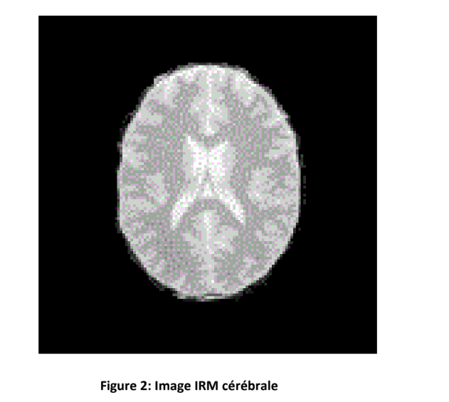
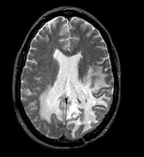

# Cerebral MRI Image Clustering using K-Means

## Overview

This project implements the k-means clustering algorithm to classify a grayscale cerebral MRI image into three clusters, representing white matter, gray matter, and cerebrospinal fluid. The image is loaded from Hadoop Distributed File System (HDFS), and the program outputs a file containing the centroid values of the clusters and the list of pixels belonging to each cluster.

</img>

## Prerequisites

- Apache Spark: Ensure that Apache Spark is installed on your system.
- Hadoop: Hadoop Distributed File System (HDFS) is used for storing the image. Make sure HDFS is set up.
- Java: The project is implemented in Java.

## Usage

1. Clone the repository:

    ```bash
    git clone https://github.com/yourusername/cerebral-mri-kmeans.git
    ```

2. Compile the project:

    ```bash
    cd cerebral-mri-kmeans
    mvn clean install
    ```

3. Run the program:

    ```bash
    spark-submit --class org.example.Main --master local[*] target/cerebral-mri-kmeans-1.0-SNAPSHOT.jar /path/to/image /path/to/output /path/to/centers.txt
    ```

    Replace `/path/to/image`, `/path/to/output`, and `/path/to/centers.txt` with the actual paths on HDFS for your image, output, and centers file.

## Input

- **Image:** The MRI image should be in grayscale, with pixel values ranging from 0 to 255.
</img>

## Output

- **clusterCenters:** The output directory containing a file with the centroid values of the clusters.

Output: clusterCenters/part-00000
This file contains the centroid values of the clusters. Each line represents the coordinates of a centroid.


101.5, 149.0, 198.0
23.5, 31.0, 39.5
148.5, 201.0, 98.5

Output: clusterAssignments/part-00000
This file contains the list of pixels belonging to each cluster. Each line represents the cluster assignment of a pixel.

0
2
1
0
1
2
0


- **clusterAssignments:** The output directory containing a file with the list of pixels belonging to each cluster.

## Example Centers.txt

Create a `centers.txt` file with three values for the initial centroids:

```plaintext
100,150,200
25,30,40
150,200,100
